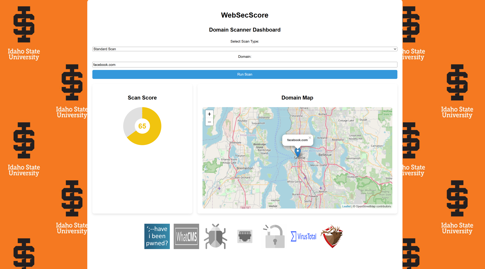
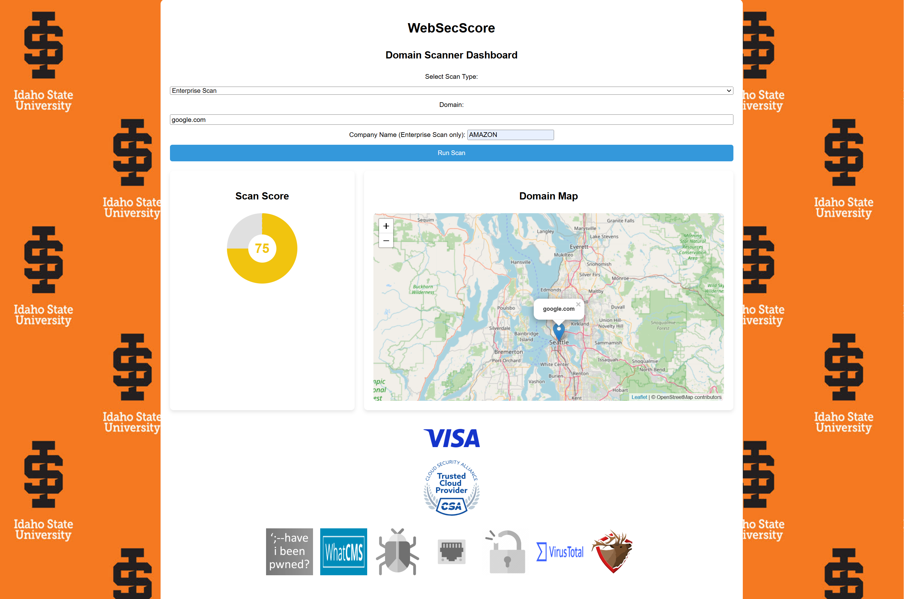

# WebSecScore
Comprehensive web application security testing tool designed to assess the security level of web domains. Subsequently, I will be implementing security tests and using some available APIs to calculate a security score for the input domain(s) and fetching the results on a web page. The project will focus on two distinct types of domains: personal domains and corporate domains. The tool will offer a suite of security tests, ensuring that personal web applications are rigorously tested for common vulnerabilities, while corporate domains will undergo additional enterprise-level tests that include compliance checks.

# Running the app
To run the web application, please navigate to `app.py` and run it, or execute `python3 app.py`.

# Project paper
Please find the project paper in this [link](https://drive.google.com/file/d/18CkCsabxsFSPlG7mUK27ipHu3meASfOy/view?usp=sharing). 

# Screenshot from the app
## Standard Scan

## Enterprise Scan

# Contribution
If you find this project interesting, please do not hesitate to reach out to me for any recommendations, questions, or suggestions.
[Email me](mailto:hamzakaddour@isu.edu)
